# Diagramas de Arquitetura — Plataforma de Controle de Vencimentos

Status: **14 de 14 diagramas completos** (seção 52), sincronizados com `architecture-fase3-consolidada.md`, `data-model.md`, `slo.md`, `disaster-recovery.md`, `evolution.md`, `mcp-readiness.md`. Atualizar este arquivo sempre que uma decisão de arquitetura mudar — os diagramas não podem divergir do texto consolidado.

## 1. System Context

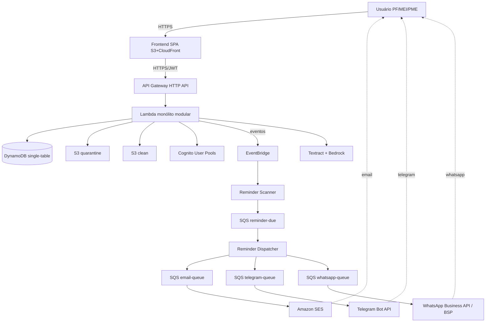

## 2. Container/Service (visão de módulos do monólito)

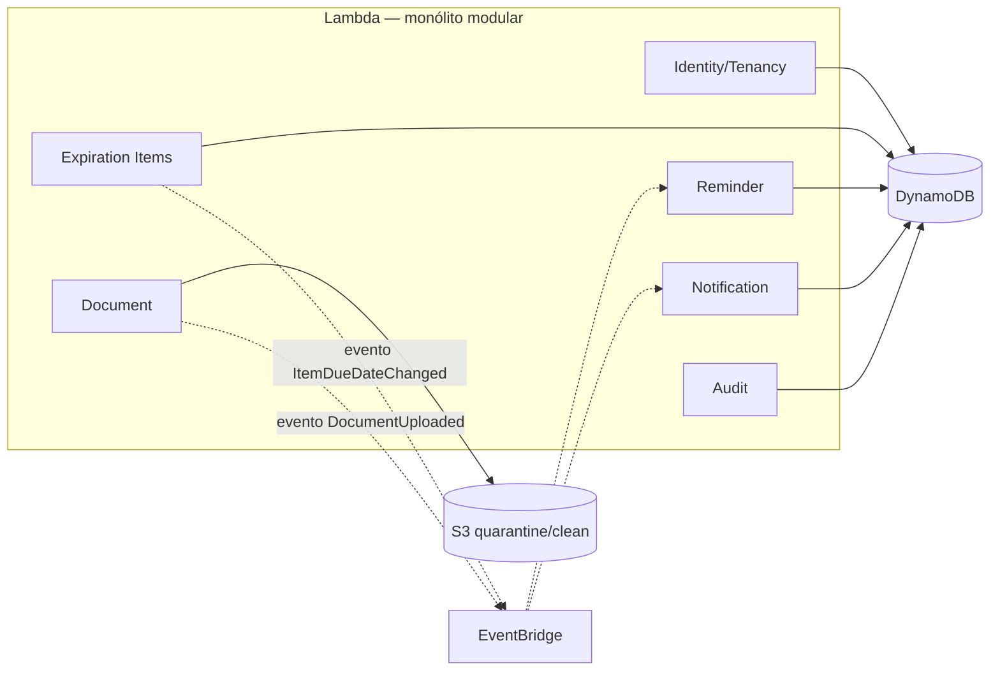

## 3. Reminder Flow (com shards por minuto)

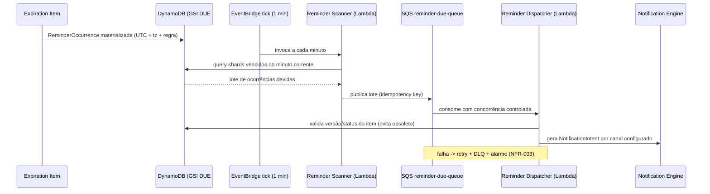

## 4. Notification Flow (adapters por canal)

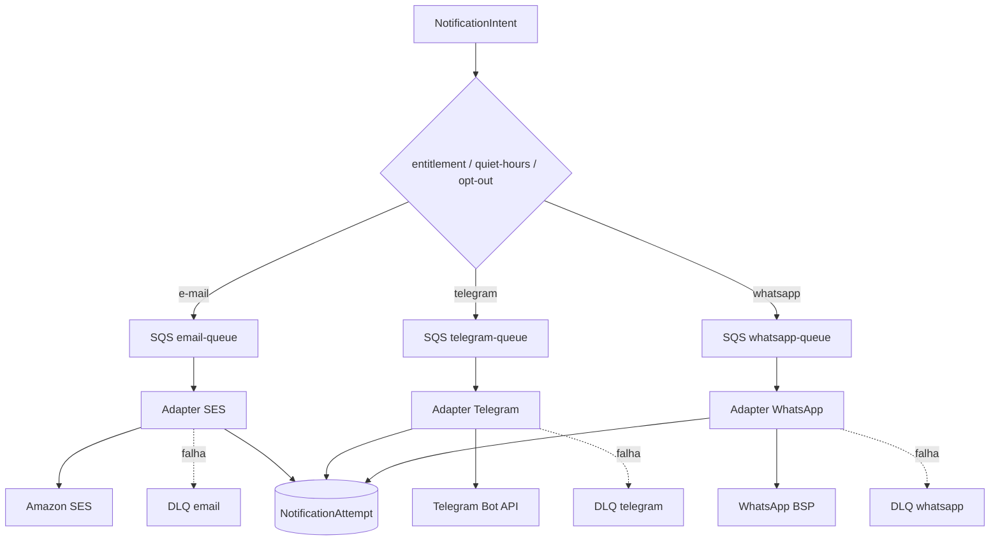

## 5. Document Upload (quarentena de 2 buckets)

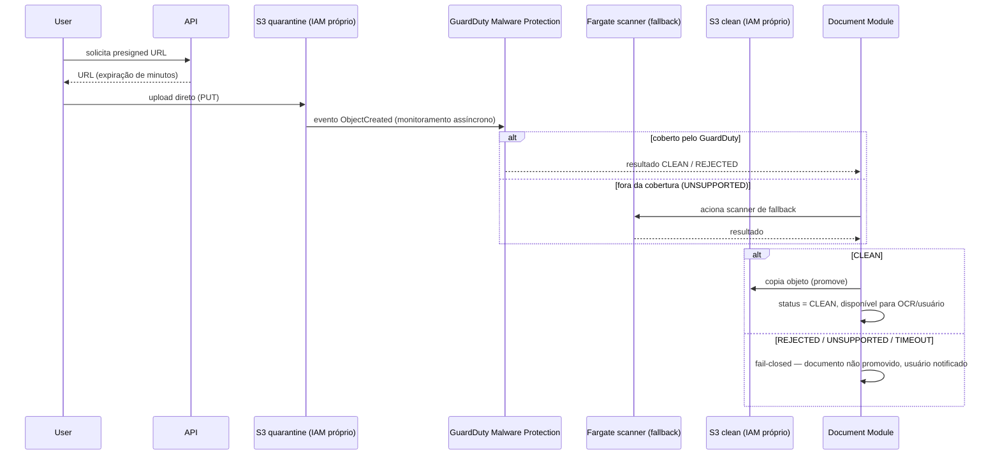

## 6. AI Extraction (fail-closed, FR-043)

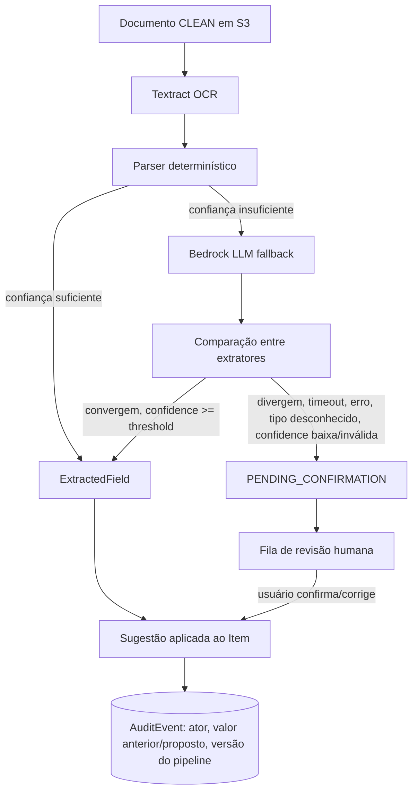

## 7. Security Boundaries

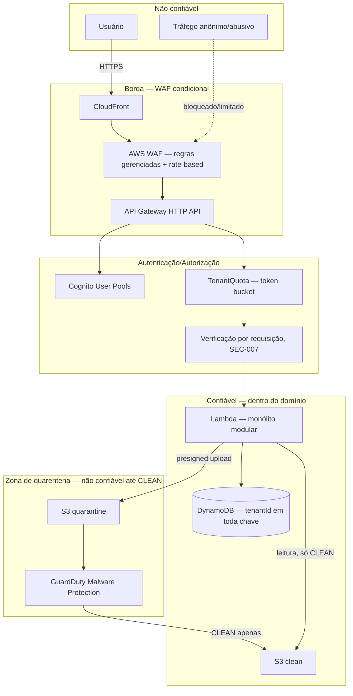

## 8. Data Flow completo (com outbox/sweeper)

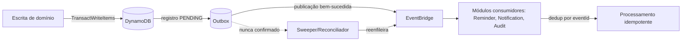

## 9. Deployment

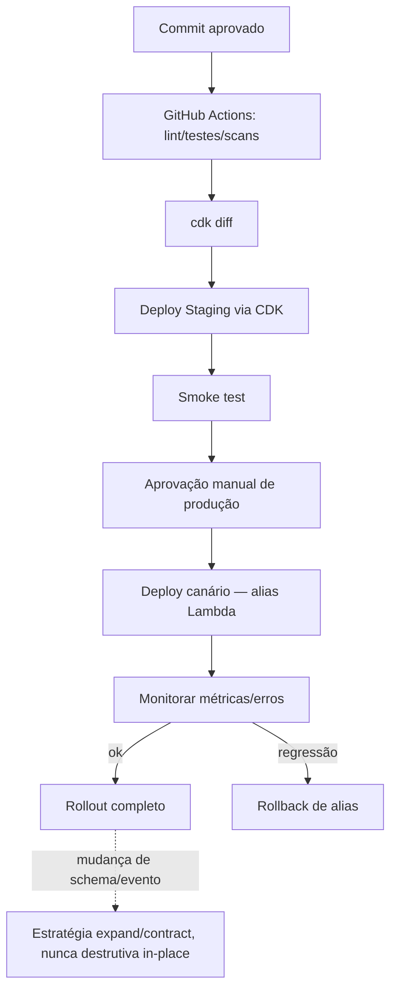

## 10. Observability

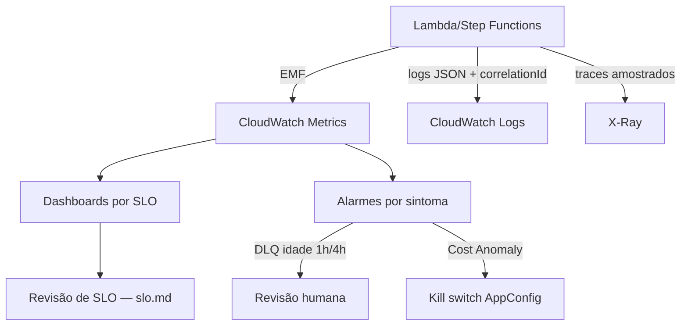

## 11. Disaster Recovery

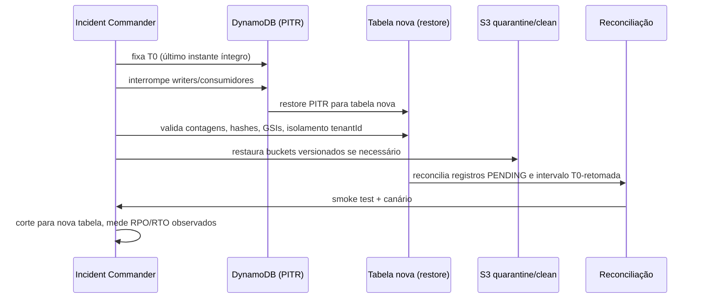

## 12. Growth Evolution

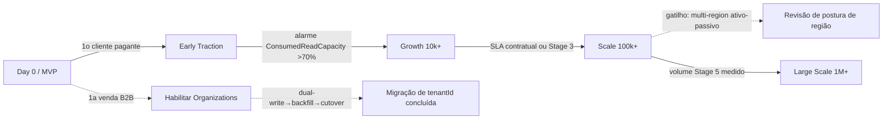

## 13. MCP Future Flow

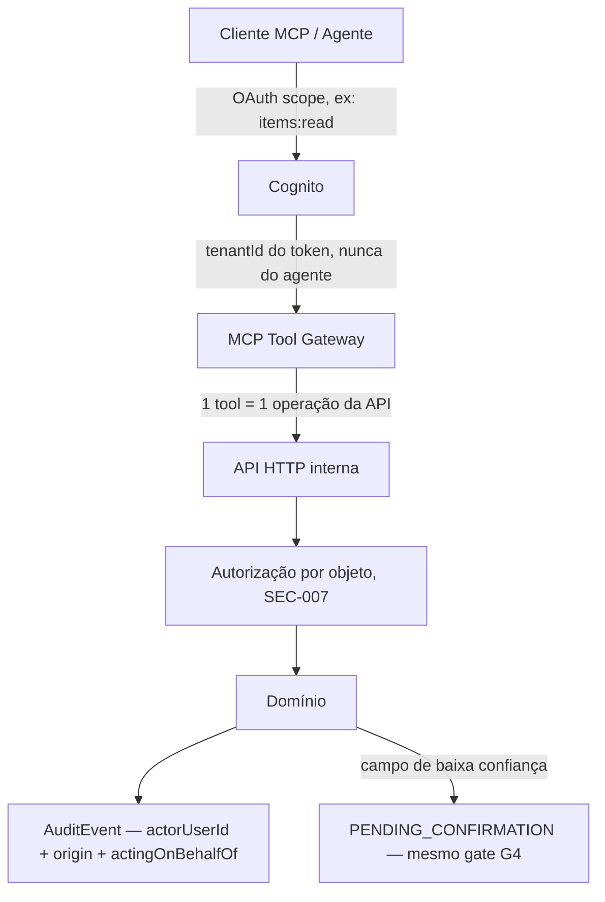

## 14. Container/Service detalhado

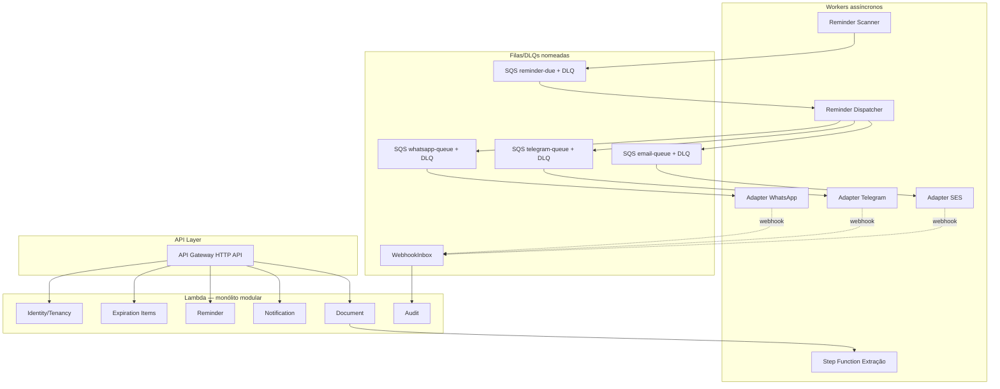

Todos os 14 diagramas exigidos pela seção 52 do prompt mestre estão agora presentes, sincronizados com `architecture-fase3-consolidada.md`, `data-model.md`, `slo.md`, `disaster-recovery.md` e `evolution.md`.
