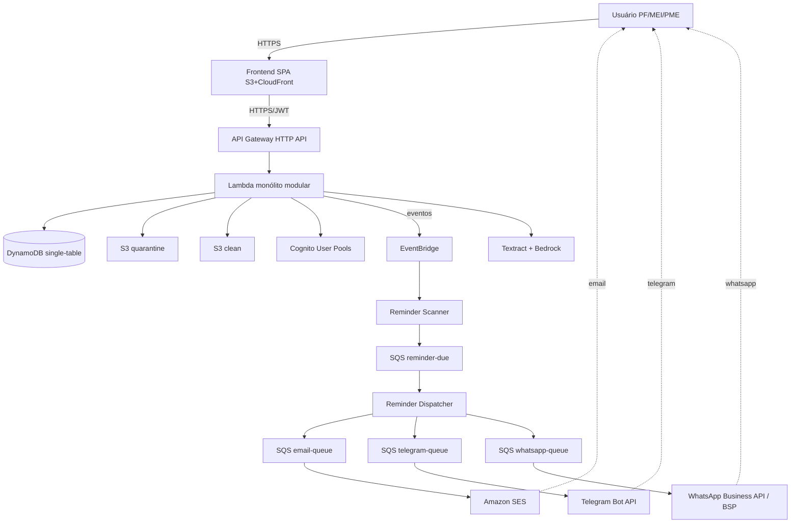
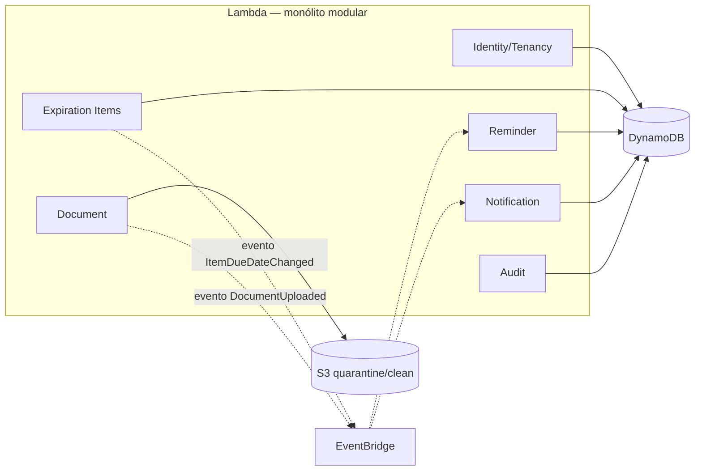
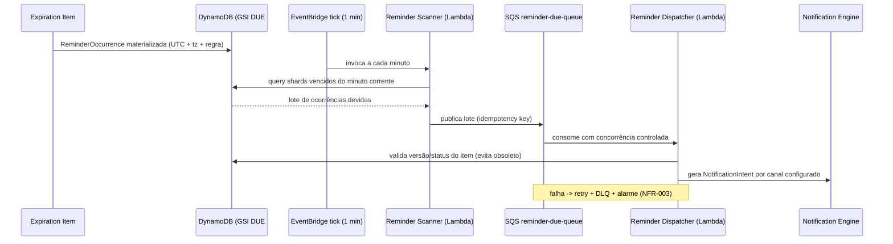
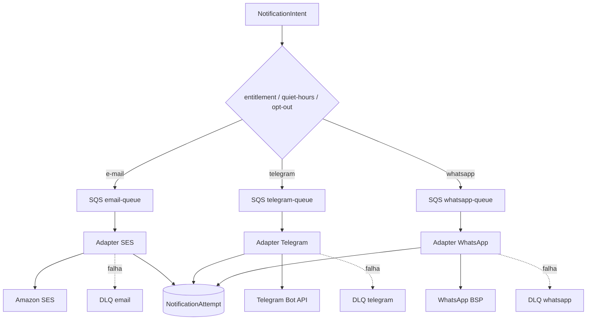
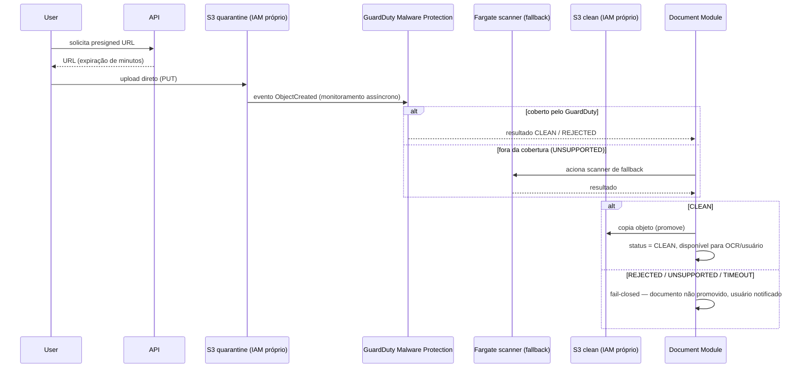
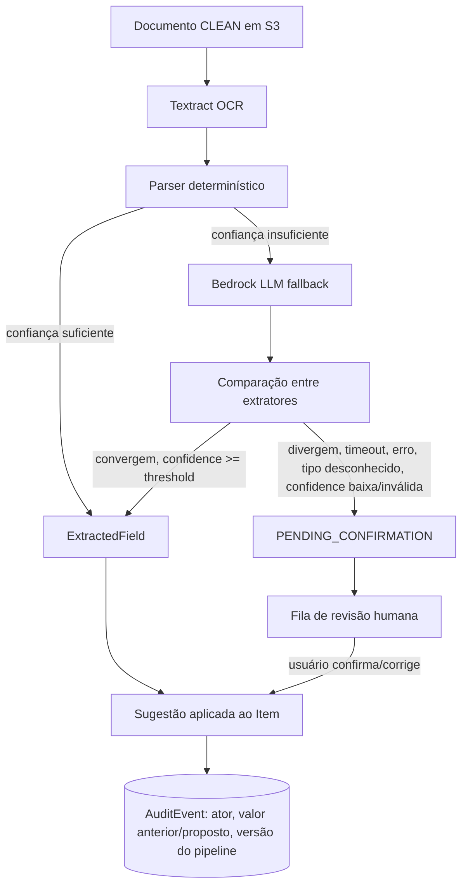

# Diagramas de Arquitetura — Plataforma de Controle de Vencimentos

Status: sincronizado com `docs/architecture/architecture-fase3-consolidada.md` (Rodada 4). Atualizar este arquivo sempre que uma decisão de arquitetura mudar — os diagramas não podem divergir do texto consolidado.
Conforme seção 52 do prompt mestre, 14 diagramas são exigidos ao final. Esta primeira leva cobre os 6 mais centrais às decisões já consolidadas; os demais (Security Boundaries, Data Flow, Deployment, Observability, DR, Growth Evolution, MCP Future Flow, Container/Service detalhado) ficam pendentes para quando os ADRs correspondentes fecharem (ver "Itens abertos" em `architecture-fase3-consolidada.md`).

## 1. System Context

## 2. Container/Service (visão de módulos do monólito)

## 3. Reminder Flow (com shards por minuto)

## 4. Notification Flow (adapters por canal)

## 5. Document Upload (quarentena de 2 buckets)

## 6. AI Extraction (fail-closed, FR-043)

## Diagramas pendentes (a produzir quando os ADRs correspondentes fecharem)
7. Security Boundaries — depende da decisão final de WAF×HTTP API (item aberto).
8. Data Flow completo (incluindo outbox/sweeper) — depende do ADR de replay (fechado conceitualmente, falta detalhar visualmente).
9. Deployment — depende do detalhamento de CI/CD (`ScopedLambdaFunction`, ambientes).
10. Observability — dashboards/alarmes concretos (depende de `slo.md`, Fase posterior).
11. Disaster Recovery — depende de `disaster-recovery.md` (RTO/RPO já têm meta, falta o fluxo de restore).
12. Growth Evolution — depende da seção "Evolução da Arquitetura" (ainda não escrita).
13. MCP Future Flow — depende de `mcp-readiness.md` (não iniciado).
14. Container/Service detalhado com todas as filas/DLQs nomeadas — versão expandida do diagrama 2 acima, a produzir junto do Implementation Blueprint (seção 60, pós-aprovação).
